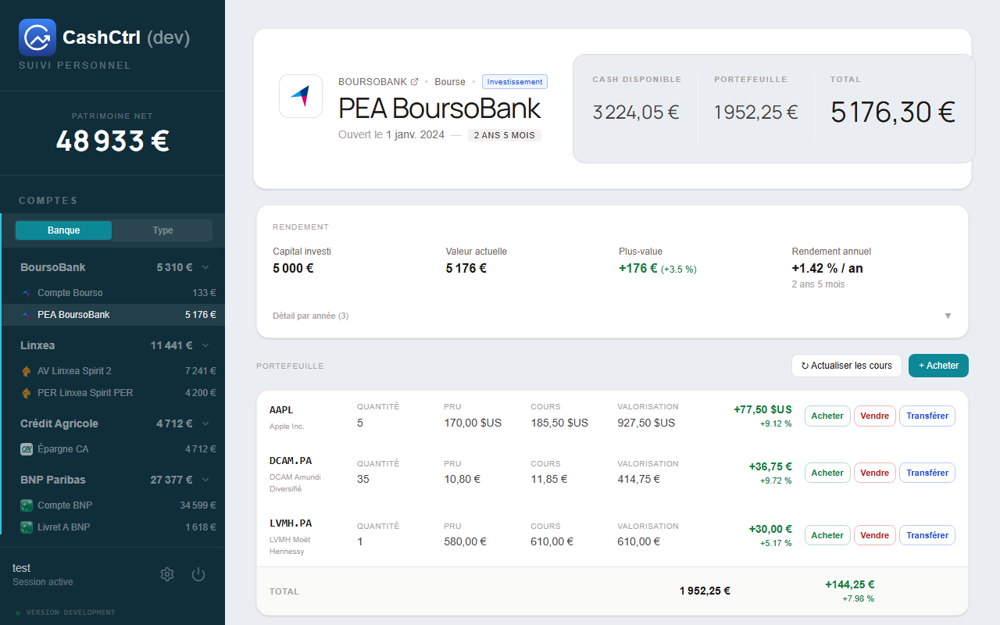
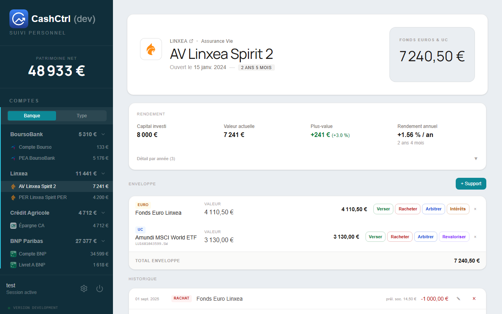
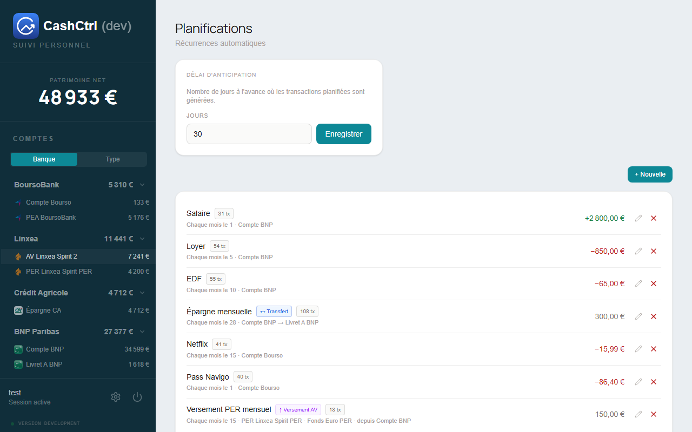
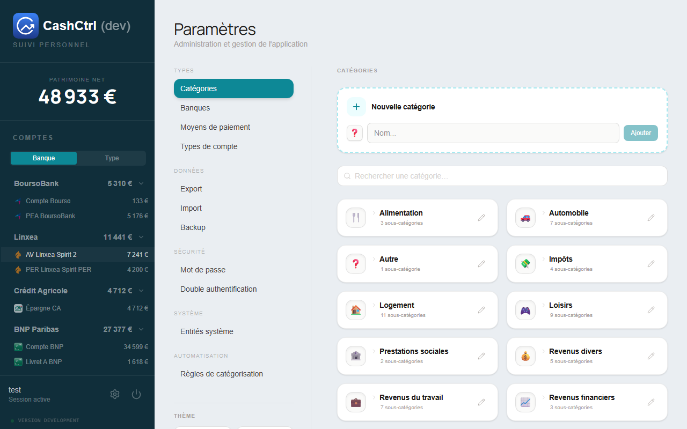
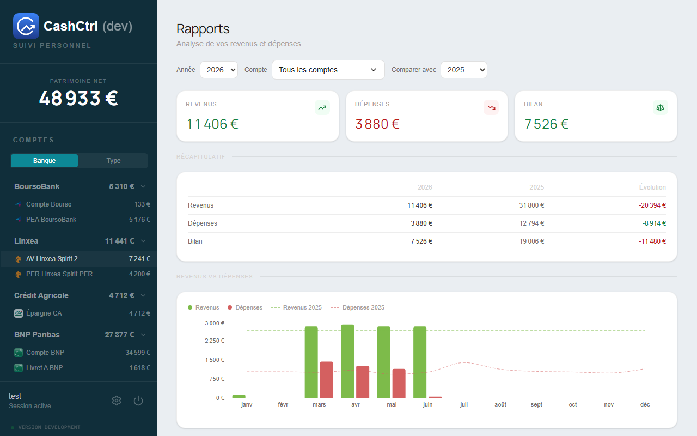
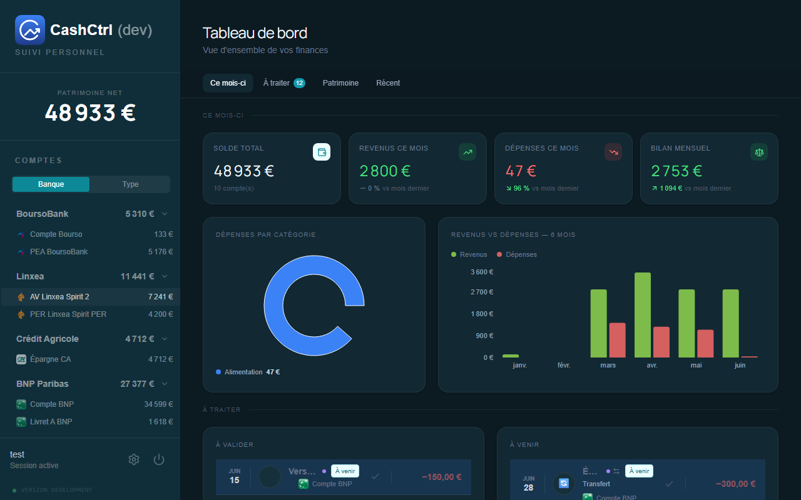

# 💸 CashCtrl

Application de gestion de finances personnelles — multi-comptes, transactions planifiées, portefeuille boursier, assurances-vie et prêts.

---

## Aperçu

| Dashboard | Transactions |
|---|---|
|  |  |

| Portefeuille boursier (PEA) | Assurance-vie |
|---|---|
|  |  |

| Planifications | Paramètres |
|---|---|
|  |  |

| Rapports |  |
|---|---|
|  |  |

### 🌗 Thème clair / sombre

L'interface suit la préférence système et se bascule manuellement (Clair / Sombre / Système) depuis les Réglages.

| Clair | Sombre |
|---|---|
|  |  |

---

## ✨ Fonctionnalités

| Domaine | Détail |
|---|---|
| **Comptes** | Multi-comptes, multi-banques avec logos auto |
| **Transactions** | Revenus / dépenses, catégories, sous-catégories, notes, fractionnement |
| **Transferts** | Double écriture atomique entre comptes |
| **Planifiées** | Récurrence flexible (jour / semaine / mois / an), gestion jours fériés |
| **Portefeuille** | Achats / ventes / transferts de titres, suivi PRU, prix historiques |
| **Assurance-vie** | Supports euro/UC, versements, rachats, arbitrages, intérêts, réévaluations |
| **Prêts** | Tableau d'amortissement, remboursements anticipés |
| **Remboursements** | Suivi des dépenses à se faire rembourser |
| **Simulateur PER** | Calcul de la déductibilité fiscale (barèmes IR en base) |
| **Rapports** | Comparaison annuelle revenus/dépenses et performances boursières par année |
| **Catégorisation auto** | Règles LIKE pour affecter automatiquement une catégorie aux transactions |
| **Import / Export** | Import QIF / XHB (Homebank) / CSV (wizard de mapping colonnes) ; export JSON toutes entités |
| **Sauvegarde** | Sauvegardes incrémentales automatiques |
| **2FA** | Double authentification TOTP (Google Authenticator, Authy…) |
| **i18n** | Interface disponible en français et en anglais via react-i18next — détection automatique de la langue du navigateur, sélecteur dans les Réglages, persistance localStorage ; namespaces par feature |

---

## 🚀 Démarrage rapide

```bash
git clone https://github.com/jerem-gt/cashctrl
cd cashctrl
npm install
npm run dev
```

- Frontend : <http://localhost:5173>
- Backend : <http://localhost:3000>

**Login par défaut :** `admin / changeme`

---

## 🧱 Stack

| Couche | Technologie | Version |
|---|---|---|
| Frontend | React + Vite | 19 / 8 |
| Style | Tailwind CSS | 4 |
| État async | TanStack Query | 5 |
| Routing | React Router | 7 |
| Backend | Node.js + Express | 24 / 5 |
| Base de données | SQLite (better-sqlite3) | — |
| Validation | Zod | 4 |
| Charts | Recharts | 3 |
| i18n | react-i18next | 15 |
| Tests | Vitest + Testing Library + MSW | 4 |
| CI/CD | GitHub Actions + Docker + Watchtower | — |

---

## 📁 Structure

```
client/src/
  pages/          → 9 pages (Dashboard, Transactions, Accounts, Reports, Scheduled, Settings…)
  components/     → Composants UI réutilisables
  features/       → Modules autonomes (settings…)
  hooks/          → Logique métier + data fetching (TanStack Query)
  lib/            → Utilitaires (format, money, parseurs, calcul fiscal)
  api/            → Client fetch

server/src/
  modules/        → 22 modules (accounts, transactions, stocks, insurance, loans, categorization-rules…)
  db/             → Schéma, seeds, migrations SQLite
  lib/            → Helpers métier (money, scheduled, backup…)
```

---

## 🧪 Tests

```bash
npm test --workspace=server   # Vitest + supertest + SQLite in-memory
npm test --workspace=client   # Vitest + Testing Library + MSW
```

---

## 🚀 Déploiement

Image Docker multi-stage via GitHub Actions. Compatible NAS Synology (docker-compose fourni).

---

## 📄 Licence

MIT
