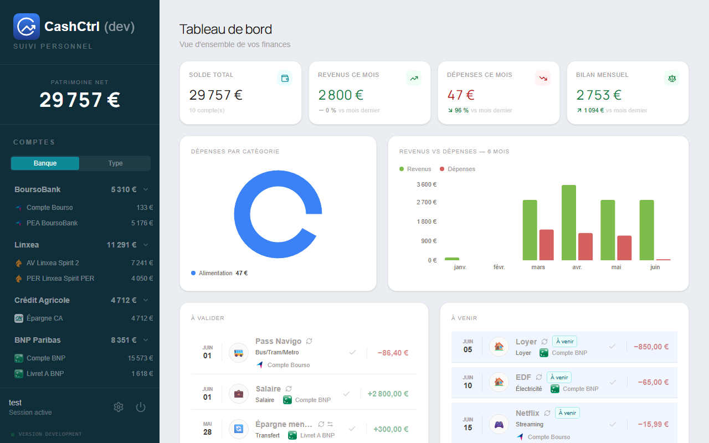
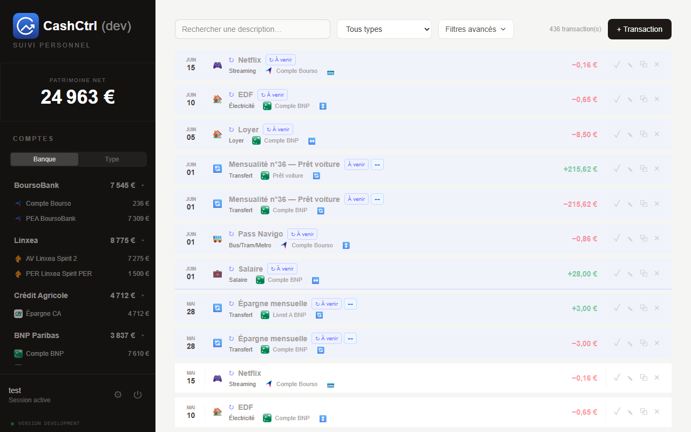

# 💸 CashCtrl

Application moderne de gestion de finances personnelles  
→ transferts intelligents, transactions planifiées et dashboard visuel.

---

## 📸 Aperçu

### Dashboard


### Transactions


### Transfert


---

## ✨ Fonctionnalités

- 💰 Gestion multi-comptes
- 🔁 Transferts automatiques entre comptes (double écriture sécurisée)
- 📅 Transactions planifiées (jours, semaines, mois…)
- 📊 Dashboard avec graphiques (Recharts)
- 🏦 Gestion des banques avec logos auto
- 🏷️ Catégories et moyens de paiement configurables
- 📤 Export CSV / JSON

---

## 🚀 Démarrage rapide

```bash
git clone https://github.com/jerem-gt/cashctrl
cd cashctrl
npm install
npm run dev
```

- Frontend : http://localhost:5173
- Backend : http://localhost:3000

**Login :** `admin / changeme`

---

## 🧱 Stack

- **Frontend** : React 19 + Vite + Tailwind CSS 4
- **State** : TanStack Query v5
- **Backend** : Node.js 24 + Express 5 + TypeScript
- **DB** : SQLite (better-sqlite3)
- **Validation** : Zod
- **Charts** : Recharts
- **CI/CD** : GitHub Actions + Docker + Watchtower

---

## 🧠 Points clés techniques

- Architecture modulaire (repo + routes + types)
- Injection de dépendances (DB)
- Transferts atomiques (2 transactions liées)
- Génération idempotente des transactions planifiées
- Tests complets (backend + frontend)

---

## 📁 Structure (résumé)

```
client/   → React app (UI + hooks + API)
server/   → Express API (modules + DB + logique métier)
```

👉 Voir la doc complète : `AGENTS.md`

---

## 🧪 Tests

```bash
npm test --workspace=server
npm test --workspace=client
npm run test:coverage --workspace=client  # couverture statements : 80.58%
```

**Frontend** : 283 tests — Vitest + @testing-library/react + MSW v2

---

## 🚀 Déploiement

- Image Docker via GitHub Actions
- Hébergement NAS (Synology compatible)

---

## 💡 Pourquoi ce projet ?

CashCtrl est conçu pour :
- maîtriser ses finances simplement
- gérer les transferts sans erreur
- automatiser les opérations récurrentes

---

## 📄 Licence

MIT
